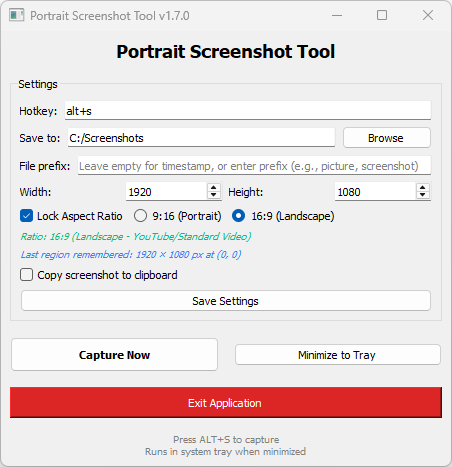

# Portrait Screenshot Tool

A lightweight, fast, and customizable **portrait-format screen capture tool** built with **PyQt5**.
Designed for creators who frequently capture **9:16 (Shorts/TikTok/Reels)** or **16:9** video frames, with a draggable overlay, global hotkey support, and auto-saving.

## Screenshot




---

## Features

* **Global Hotkey Capture** (default: `Ctrl + Shift + P`)
* **Resizable & Movable Capture Overlay** with live dimensions
* **Multi-monitor support** — captures across all screens
* **Aspect Ratio Lock** (9:16 or 16:9) with auto-adjusting size
* **Remembers last capture region**
* **Auto-save to chosen directory**
* **Optional: Copy screenshot to clipboard**
* **Minimizes to system tray**
* **Toast notifications** for success/error

---

## Installation

### 1. Create and activate a virtual environment
```bash
python -m venv .venv
.\.venv\Scripts\activate
```

### **2. Install dependencies**

```bash
python.exe -m pip install --upgrade pip
pip install PyQt5 keyboard
```

### **3. Run the application**

```bash
python src/main.py
```

### **4. Package the application (optional)**

```bash
pip install pyinstaller
pyinstaller --onefile --icon=res/icon.ico src/main.py
```

---


## How to Use

1. Launch the app → it runs in the system tray
2. Press the global hotkey to open the capture overlay
3. Drag / resize the selection area
4. Press **Enter** to capture, or **Esc** to cancel
5. Screenshots are saved automatically (and copied to clipboard if enabled)

---

## Settings

Inside the UI, you can configure:

* Hotkey
* Save location
* Width & height
* Aspect ratio lock (9:16 or 16:9)
* Clipboard behavior
* See last captured region

Settings persist across sessions in
`~/.portrait_screenshot_settings.json`.

---

## License

MIT License.

---